# Animator

    

 

  
## 🤖 Model

TODO

## 🖌️ Visual Output

Some output of **Stage 1: Dreambooth-LoRA**.

  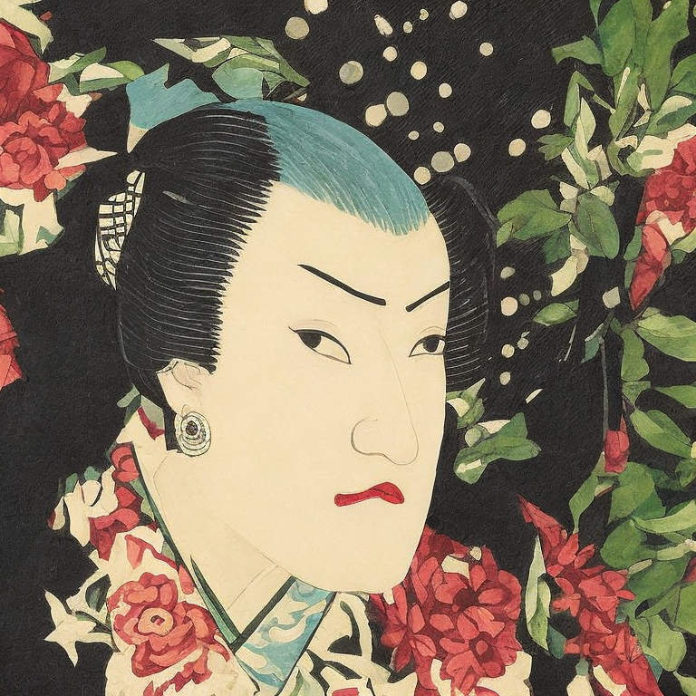
  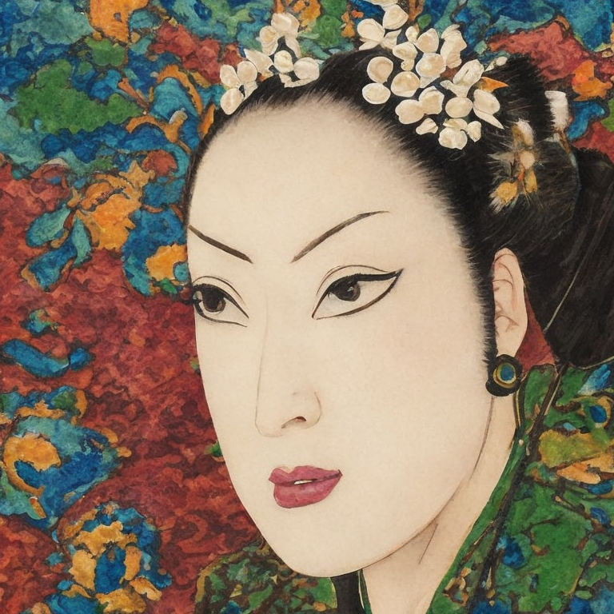
  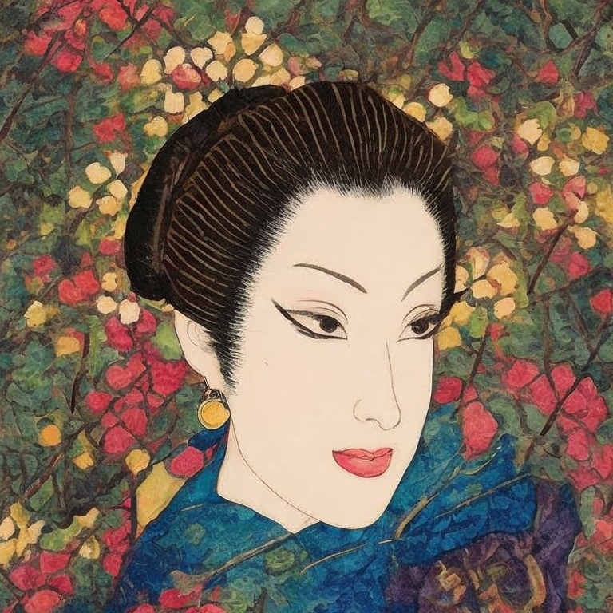

  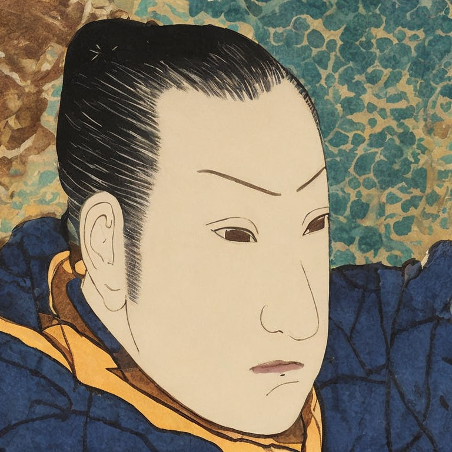
  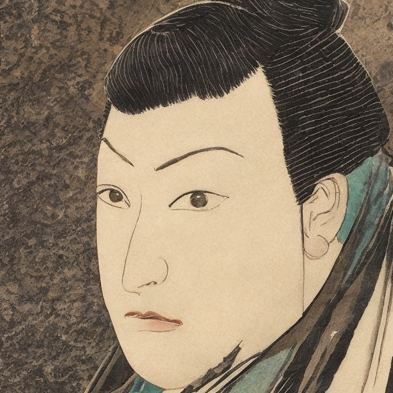
  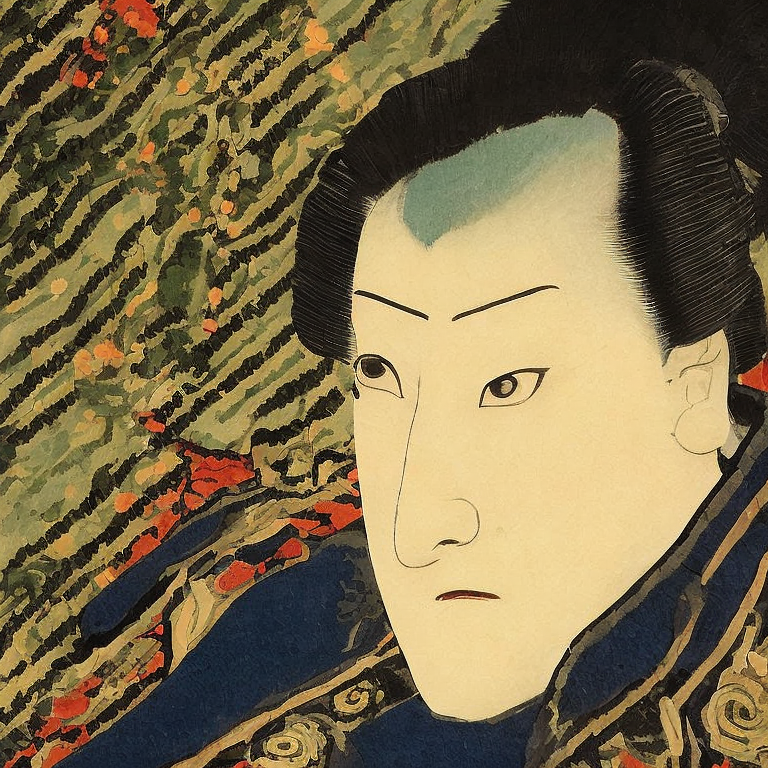

Some output of **Stage 2: ControlNet-Dreambooth**.

  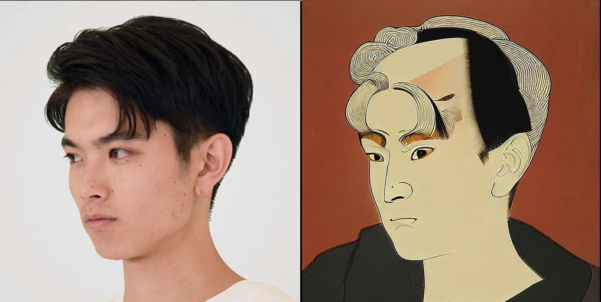
  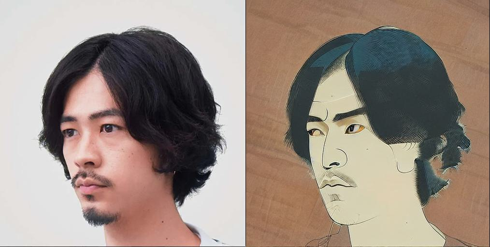

  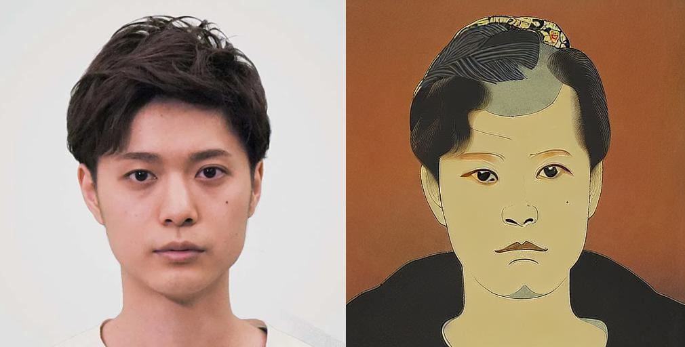
  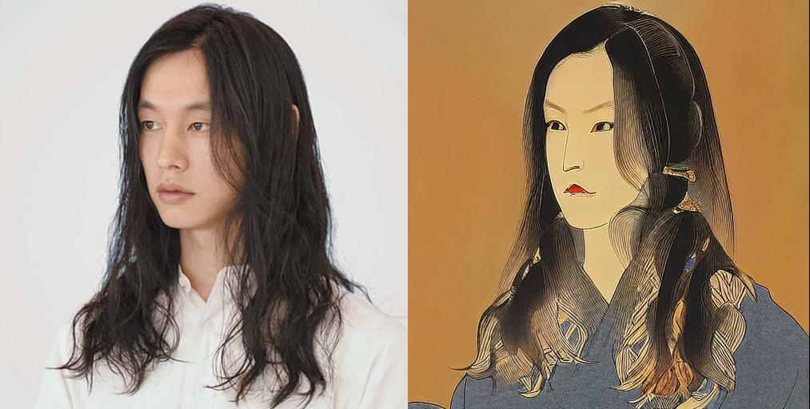

## 🚀 Transformation

Styling process of an input image with **Animator**. With `control scale = 0.1` of controlnet

| Input  |  Control Scale (CS) 0.1 |
:-------------------------:|:-------------------------:
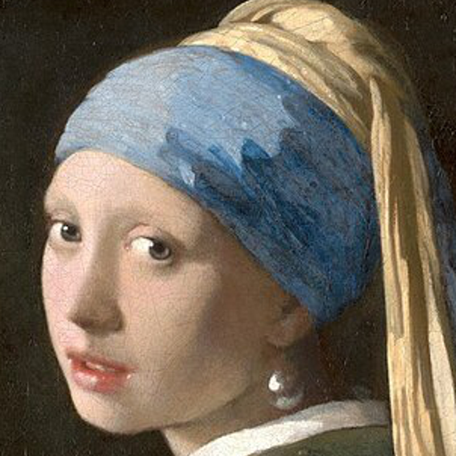 |  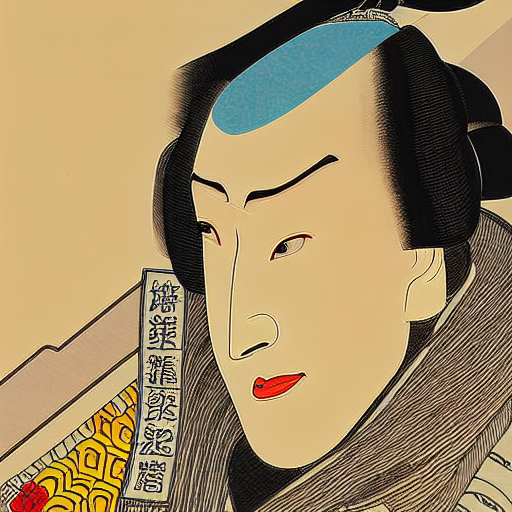

Keeping the `lora scale = 1.0`, varying the `control scale` produces smooth transformation by injecting target style into the input image, shown below.

| **CS 0.4**  |  **CS 0.5** | **CS 0.6** 
:-------------------------:|:-------------------------:|:-------------------------:
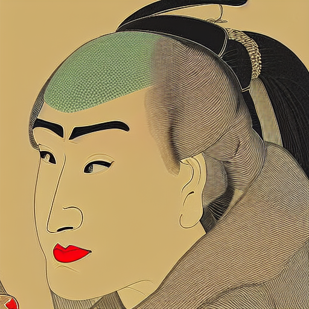 | 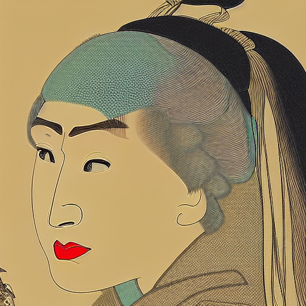 | 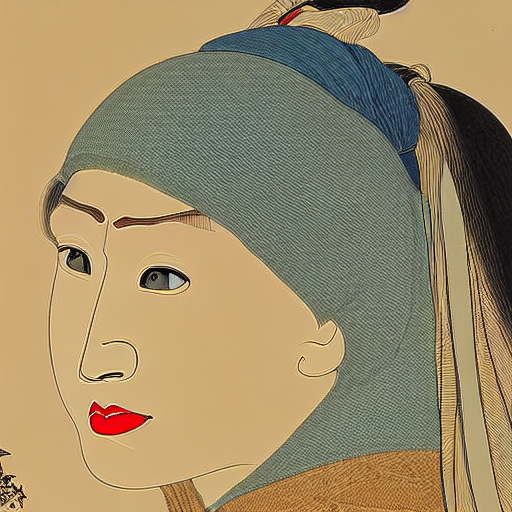 

| **CS 0.7** | **CS 0.8** | **ALL** 
:-------------------------:|:-------------------------:|:-------------------------:
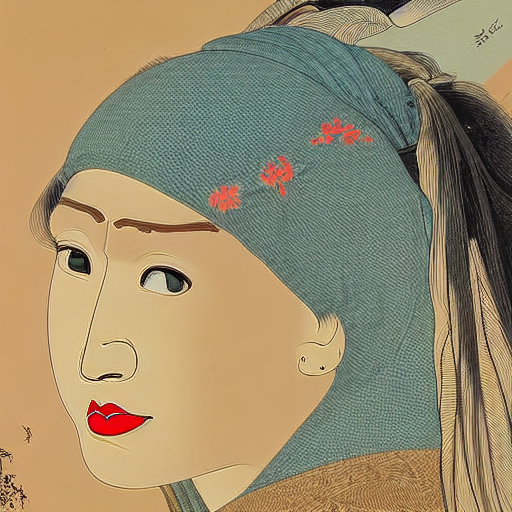 |  | 

## 🔥 Gradio UI

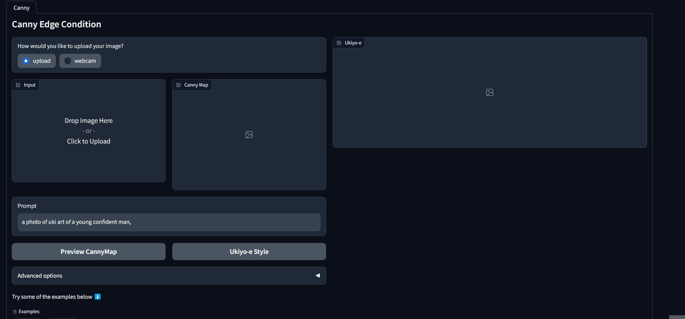

